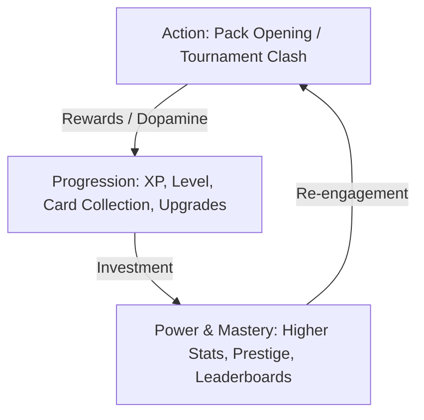

# Game Design & Ideation Skill

This skill guides the design, brainstorming, mathematical balancing, and dopamine architecture for engaging web and digital games.

---

## 1. Core Pillars of Addictive Web Game Design

Every successful game loop balances three fundamental cycles:

### Pillar A: The Micro-Loop (0–30 Seconds)
* **Immediate Feedback & Juiciness**: Screen rumble, glowing particle bursts, sound pitch escalations (e.g. rising pitch on pack peel).
* **Clear Win/Loss Clarity**: Instant clarity on whether a pull or match was standard, rare, or legendary.

### Pillar B: The Meso-Loop (5–15 Minutes)
* **Timed Tournament Runs**: Focused 15-minute challenge runs (e.g. Football Squad Clash vs King Jeff).
* **Missions & Objectives**: Hourly and daily reward milestones that encourage quick sessions throughout the day.

### Pillar C: The Macro-Loop (Days to Months)
* **Collection Index & Discovery**: 100% completion goals, exclusive historic icons, serialized low-mint number cards (e.g. #1 of 10).
* **Skill Trees & Metagame**: Permanent stat boosts, luck multipliers, and crafting alchemy.

---

## 2. Dopamine Mechanics & Gacha Pacing

### 1. Probability Curve Distribution
When architecting pack drop tables, use tiered exponential decay with pity thresholds:

| Rarity Tier | Drop Chance | Visual Feedback | Audio Cue |
| :--- | :--- | :--- | :--- |
| **Common** | 50.0% | Slate/Silver Border | Low thud |
| **Uncommon** | 30.0% | Emerald Green Glow | Crisp bell |
| **Rare** | 14.0% | Deep Blue Shimmer | Rising chime |
| **Exclusive** | 4.5% | Amethyst Purple Flame | Heavy bass rumble |
| **Legendary** | 1.2% | Radiant Amber Flare | Fanfare brass |
| **Mythic** | 0.25% (1 in 400) | Neon Ruby Pulsar | Shockwave thunder |
| **Secret** | 0.04% (1 in 2,500) | Void Portal Warp | Cosmic echo |
| **World Class** | 0.01% (1 in 10,000) | Full Sol's RNG Cutscene | Cinematic orchestral drop |

### 2. Sol's RNG Style Cinematic Cutscenes
* **Pacing**: Tension build-up (black screen -> expanding ring -> color flash -> character splash -> serial number reveal).
* **Rarity Suspense**: Introduce 1.5s delay before revealing 1/10,000 cards to maximize anticipation.

---

## 3. Deck-Building & Synergy Combinations (Balatro / Poker Formats)

When adapting card battle systems, map card attributes (Rating, Position, Rarity, Club/Nation) into Poker-like hands:

1. **Royal Squad (50x)**: 5 cards with 95+ OVR rating.
2. **Synergy Flush (20x)**: 5 cards of the exact same Rarity tier.
3. **Rating Straight (15x)**: 5 consecutive ratings (e.g. 91-92-93-94-95).
4. **Full Team (12x)**: 3 Attackers + 2 Midfielders (or matching tactical formation).
5. **Position Flush (10x)**: 5 cards sharing the same field sector.
6. **Triple Threat (5x)**: 3 cards matching Position or Rarity.
7. **Dual Formation (3x)**: Two pairs of matching attributes.
8. **Star Pair (1.5x)**: Two matching cards or ratings.

---

## 4. Virtual Economy & Anti-Inflation Rules

1. **Coin Sinks**: Ensure currency is constantly recycled via:
   - Scouting pack purchases.
   - Profile cosmetic frames and backgrounds.
   - Alchemy potion crafting (burning cards for luck/XP potions).
   - High-stakes tournament ante bets.
2. **Dynamic RAP (Recent Average Price)**: Base trade and market values on card scarcity and demand rather than static hardcoded numbers.
3. **Audit Ledger Logging**: Log every currency delta and card mutation to prevent duping and balance exploits.
