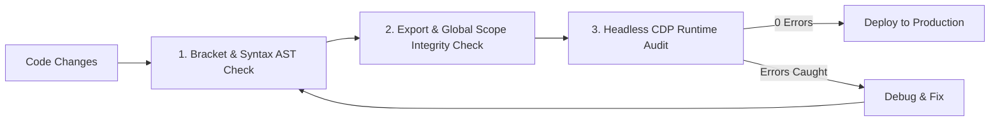

# Robust Game QA & Automated Testing Skill

This skill defines the mandatory testing protocols, automated verification scripts, and diagnostic pipelines required to guarantee 0 runtime errors, 0 browser freezes, and 100% data persistence.

---

## 1. Automated Verification Checklist (Run Before Every Release)



### Step 1: Bracket & AST Syntax Validation
* Verify that all parenthetical, curly, and square bracket pairs are 100% balanced.
* Verify that string literals and multiline comments do not hide unclosed braces.

### Step 2: Exported Actions & Global Scope Integrity
* **Crucial Rule**: Never put an identifier in `EXPORTED_ACTIONS` or `window[...]` unless that function or constant is physically declared above or in the current scope.
* An undefined identifier in an object literal (e.g. `{ undefinedFunction }`) throws an uncaught `ReferenceError` at script load time, terminating script execution and freezing all UI event listeners.

### Step 3: Headless Chrome / Edge DevTools Protocol (CDP) Audit
* Launch a headless browser instance connecting to the test build.
* Listen to `Console.messageAdded` and `Runtime.exceptionThrown`.
* Assert:
  1. `UNCAUGHT EXCEPTIONS == 0`
  2. `window.state` is initialized and defined.
  3. `state.accountUser` successfully loaded from storage/database.
  4. Buttons and page navigators respond to click events.

---

## 2. Automated Test Runner Script

Use the bundled test runner script in `scripts/verify_game_health.py` to execute all 3 validation tiers with a single command:

```powershell
python ".agents/skills/robust-game-qa-testing/scripts/verify_game_health.py"
```

---

## 3. Diagnosing Browser Freezes & Lockups

When a browser tab becomes unresponsive (frozen), follow this diagnostic hierarchy:

| Symptom | Primary Suspect | Fix |
| :--- | :--- | :--- |
| **Buttons don't click on page load** | Uncaught `ReferenceError` during script evaluation | Run export integrity check and fix missing function declarations |
| **Laggy scrolling / FPS drops** | `renderAll()` rebuilding entire DOM on timer ticks | Switch to **Targeted Lazy Rendering** (only render the single visible `.page`) |
| **Tab consumes 100% CPU** | Infinite `while` loop or synchronous recursion in `setInterval` | Ensure loop termination conditions and throttle intervals to >= 1000ms |
| **Network spam / Server rate limit** | Un-throttled `saveGame()` or `syncCloud()` in 1s interval | Debounce cloud sync and throttle auto-save to 30s |
| **Logged out on refresh** | Asynchronous race condition overwriting `localStorage` | Use synchronous session anchors and immutable guest protection |
